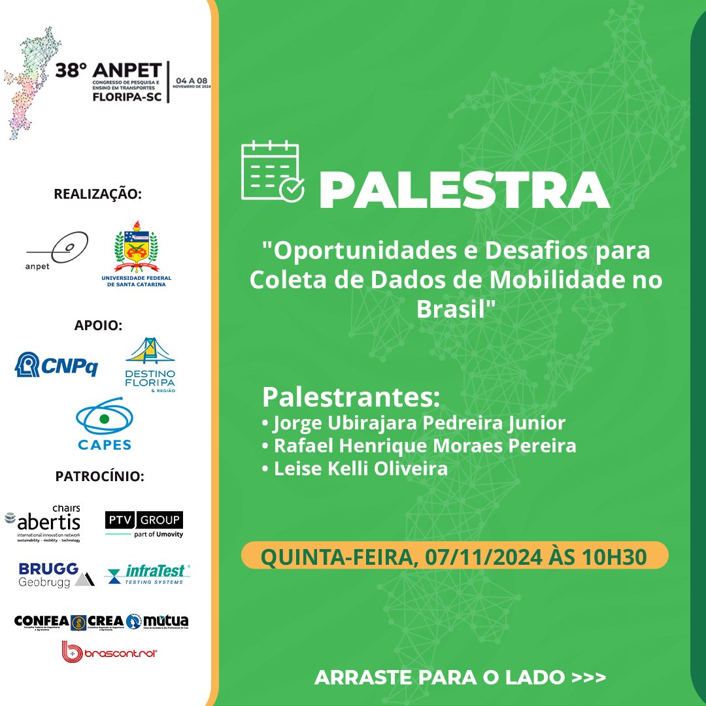

## Custom maps from census data with the {cnefetools} R package (Workshop)

{width="250" style="float: left; margin-right: 15px; margin-bottom: 10px;"} This workshop (delivered in Portuguese) was presented to the [**Gamma Research Group**](https://gamma.ufba.br/) on February 25, 2026, and focused on the dasymetric interpolation functions of the [**{cnefetools}**](https://pedreirajr.github.io/cnefetools/) R package. The session demonstrated how census tract data (which are inherently tied to the geometries of Brazil's IBGE census tracts) can be reaggregated onto arbitrary spatial units of interest, such as H3 hexagonal grids or user-supplied polygons, using residential address points from the CNEFE as ancillary data. The slides, R code, and a full recording of the workshop are available at the links below.

[Slides](talks/2026-02-25_workshop_gamma/Mapas%20personalizados%20(Workshop%20Gamma).pdf){.btn .btn-outline-primary .btn-sm} <a href="talks/2026-02-25_workshop_gamma/script_workshop.R" download class="btn btn-outline-primary btn-sm">R Script</a> [YouTube video](https://www.youtube.com/watch?v=cxetuzCoHUk){.btn .btn-outline-primary .btn-sm}

## Opportunities and Challenges for Mobility Data Collection in Brazil (38th ANPET Congress)

{width="250" style="float: left; margin-right: 15px; margin-bottom: 10px;"} This roundtable presentation (delivered in Portuguese) was given at the **38th ANPET Congress** in Santos, November 2024. Drawing on two international benchmark experiences, the talk examined pathways and obstacles for modernizing mobility data collection in Brazil. The first reference was the [**NextGen NHTS**](https://nhts.ornl.gov/od/) (National Household Travel Survey), a US initiative that integrates continuous passive mobile device tracking with a probabilistic biannual household survey to produce a national origin-destination matrix with imputed sociodemographic attributes. The second was the [**MPN**](https://english.kimnet.nl/the-netherlands-mobility-panel) (Netherlands Mobility Panel), a longitudinal annual web-based mobility survey operating since 2013, notable for multi-year panel retention rates consistently above 80%. Both frameworks were discussed in light of Brazil's structural challenges: variable data quality, sampling representativeness, LGPD privacy constraints, computational intensity, and the need for interministerial and inter-institutional coordination to enable a comparable national mobility data infrastructure. The slides are available at the link below.

[Slides](talks/2024-11-07_38anpet/Mesa%20Redonda%20ANPET%20(Jorge).pdf){.btn .btn-outline-primary .btn-sm}
