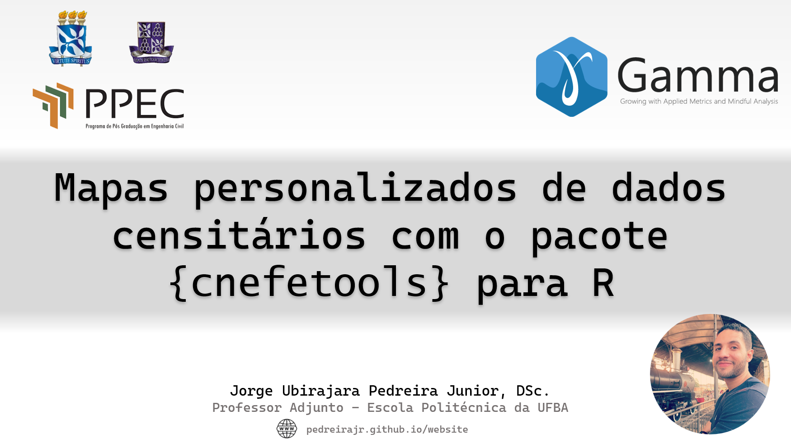

## Custom censitary maps with the {cnefetools} R Package (Workshop Gamma)

{width="200" style="float: left; margin-right: 15px; margin-bottom: 10px;"} This workshop was delivered to the [**Gamma Research Group**](https://gamma.ufba.br/) on February 25, 2026, and focused on the dasymetric interpolation functions of the **{cnefetools}** R package. The session demonstrated how census tract data (which are inherently tied to the geometries of Brazil's IBGE census tracts) can be reaggregated onto arbitrary spatial units of interest, such as H3 hexagonal grids or user-supplied polygons, using residential address points from the CNEFE as ancillary data.

[Slides](talks/2026-02-25_workshop_gamma/Mapas%20personalizados%20(Workshop%20Gamma).pdf){.btn .btn-outline-primary .btn-sm} <a href="talks/2026-02-25_workshop_gamma/script_workshop.R" download class="btn btn-outline-primary btn-sm">R Script</a> [YouTube video](https://www.youtube.com/watch?v=cxetuzCoHUk){.btn .btn-outline-primary .btn-sm}
